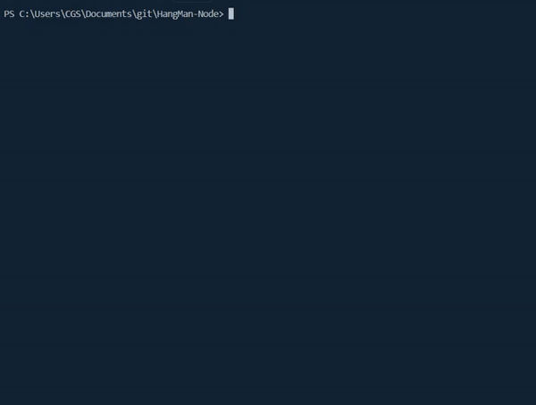

# H_NG M_N Node Edition

:pencil2: This is a command line version of the popular hangman game. 

## Usage

clone this repo and run `node  .` 

## Concepts tackled

- OOP concepts
- Constructors
- Module.exports
- Inquirer.JS
- Node Libraries

